# CANBus_SaleaeLogic_Analyzer
Sniffing CAN Bus with Saleae Logic Analyzer

## Getting Started
In this repository, I will talk about how to use the Sealea Logic analyzer for sniffing CAN Bus.

## The Wiring
The Saleee logic analyzer doesn't support working with differential busses like CAN bus, so we have to wire a CAN bus transceiver with it in order to convert the bus to single ended, here is the wiring diagram:

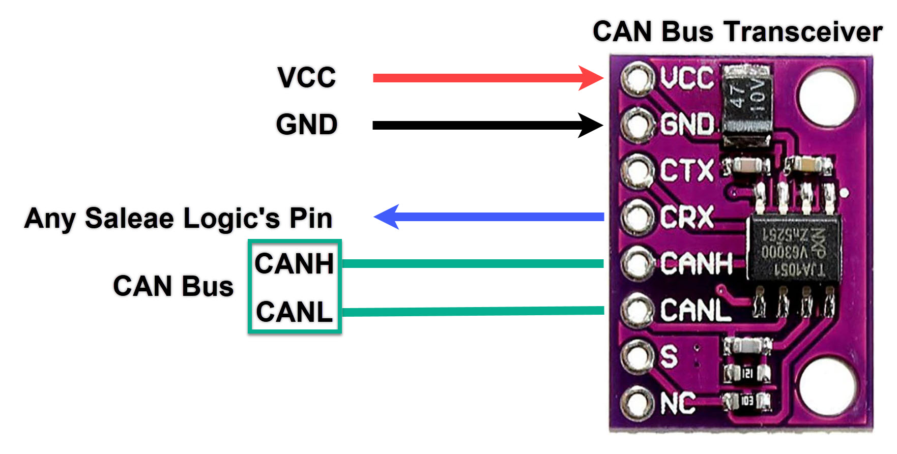

Examples for CAN transceiver modules:

* NXP TJA1051
* Microchip MCP2551
* Microchip MCP2542

| CAN Bus Transceiver Module  | Connected To |
| ------------- | ------------- |
| VCC  | External Power Supply 5V |
| GND  | GND |
| CTX  | Not Connected |
| CRX  | Connect to any Saleae Logic's digital pin |
| CANH  | Connect CANH to the CAN Bus to be sniffed |
| CANL  | Connect CANL to the CAN Bus to be sniffed |
| S  | Not Connected |
| NC | Not Connected |

## Configuring Saleae Logic Software
After configuring the connection, we will need to open our logic analyzer's software, I will use [Logic 1.2.18](https://downloads.saleae.com/logic/1.2.18/Logic+Setup+1.2.18.exe) for example.

After opening the software, you will see this picture for the program.

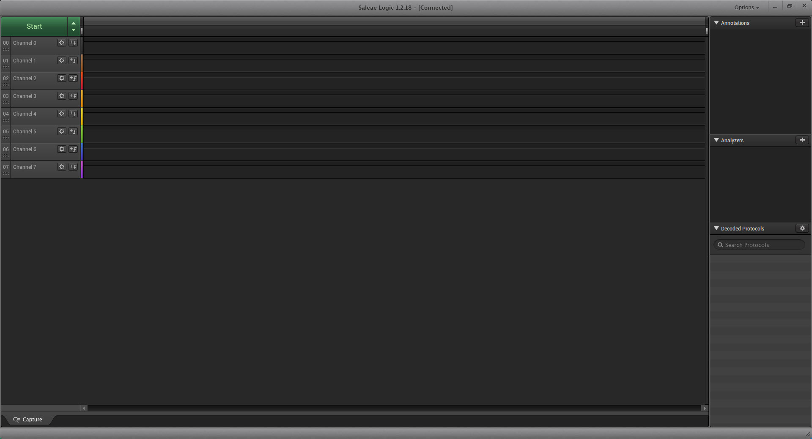

On the right hand side you will se a small pannel called "Analyzers"

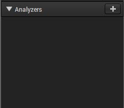

Click the "+" button on this panel, a menu will show like this:

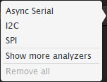

Choose "Show more analyzers", the menu will be expanded. Choose "CAN"

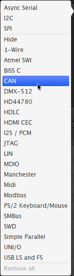

A small screen will show like this

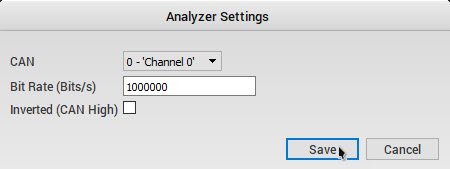

| Analyzer Settings  | Value |
| ------------- | ------------- |
| CAN  | Choose the channel that will be connected to the CAN bus transceiver's Rx pin  |
| Bit Rate (Bits/s)  | Choose the bit rate of the CAN bus |
| Inverted (CAN High)  | Leave this unchecked |

Press save.

Now we will set the triggering settings for the CAN's pin, it simply keeps the program waiting until it find the "Falling edge of the signal", then it samples the signal and recording it for a certain ammount of time. Click on the triggering icon on the channel and choose "Trigger on Falling Edge".

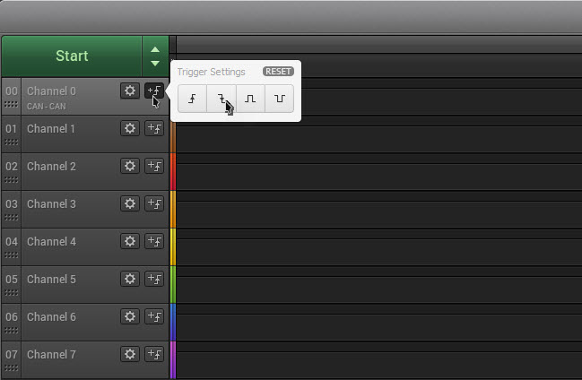

Now we will need to set the record time ( Choose the required duration of your recorded data ), I have choosed 5 Seconds.
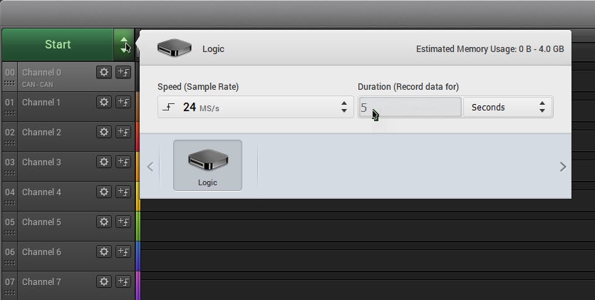

Now press the "Start" button on the left, the following window will show, it tells you that the program will wait until it finds any "Falling Edge on the Bus", that means if any data is found on the bus at any time it will trigger the  program to record for 5 Seconds.

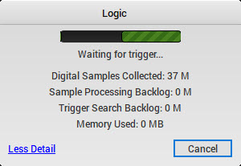

when the program finds any data on the CAN bus, the window will tell you that its sampling now and the data will be showen.

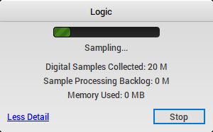

Now after the sampling period is ended, the data will be shown on the program like this.

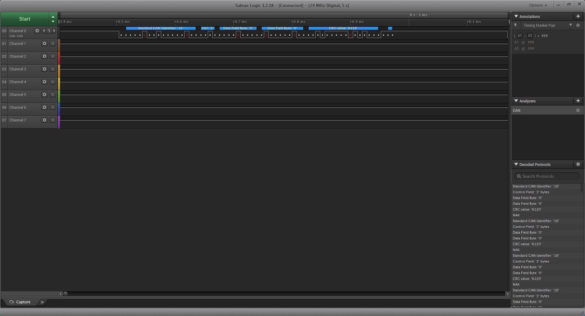

Happy Reverse Engineering :upside_down_face::joy:.

## Support Me
If you seen my work and it helped you, please support me on LinkedIn by endorsing my skills. It will be appreciated :grinning:.

   &nbsp;

